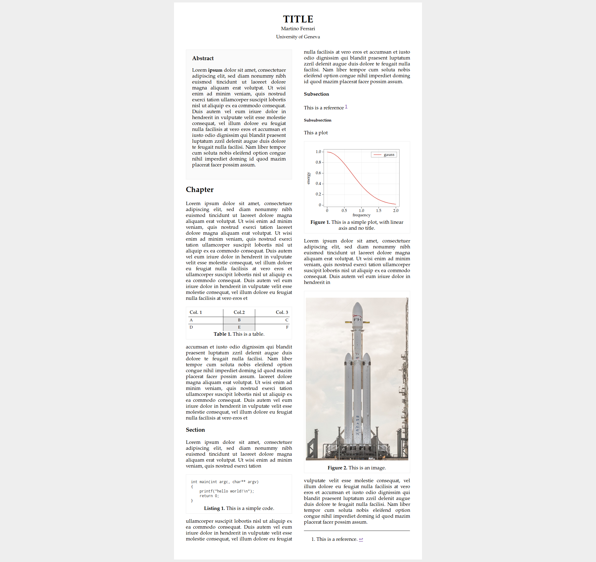

Scidown
=======

`Scidown` is a fork of [Hoedown](https://github.com/hoedown/hoedown),
a c Markdown parser. `Scidown` however it parse not only Markdown but also Scidown (yep same name) that support many features useful for scientific and scholar publishing.

Features
--------

*	**Integrated plot** using [charter](https://github.com/mandarancio/charter
*   **Figures, Tables and Listings with caption**
*   **YAML header** specify title, authors, css style, keywords and more
*   **Abstract** syntax for defining abstracts
*   **Include external files** include external files to build complex documents

Example
--------
An example of `scidwon` syntax is available in the ```examples/``` folder, this is a screenshot of the parsing of a simple example using the ```scidown.css`` style:


